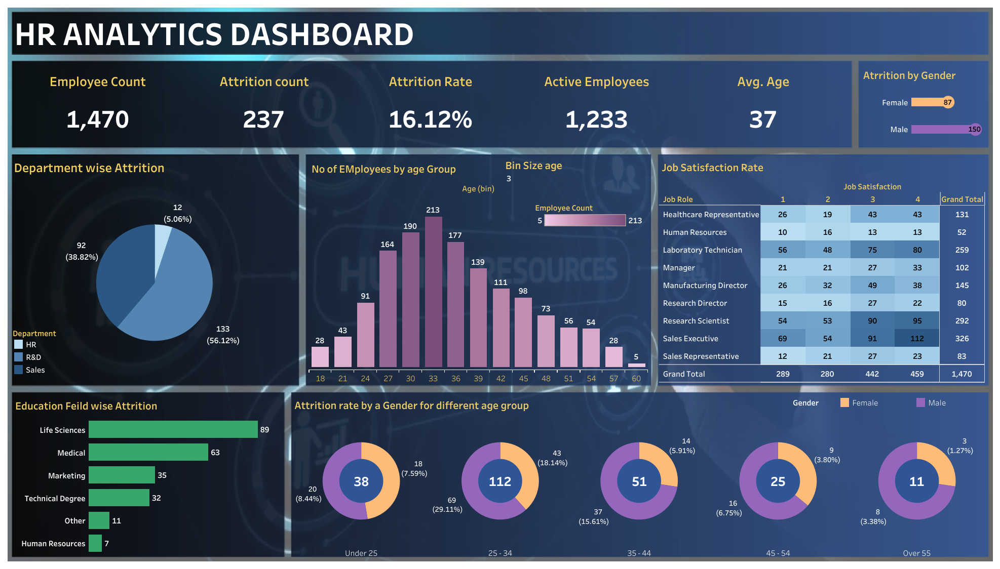

# HR Analytics Dashboard (Tableau)

This project presents an interactive HR analytics dashboard built using Tableau.  
It visualizes key employee data to help understand attrition patterns, job satisfaction, and workforce distribution.

## 🔍 Key Features
- Overall attrition analysis
- Department-wise employee distribution
- Gender and age breakdown
- Education field vs attrition rate
- Job satisfaction and performance overview

## 📂 Files Included
- `HR_Analytics_Dashboard.twbx` – Tableau packaged workbook
- `dashboard_preview.png` – Screenshot of the dashboard

## 🛠️ Tools Used
- Tableau
- IBM HR Analytics Dataset

## 📸 Dashboard Preview

## 📌 About the Dataset
This dashboard is based on the IBM HR Analytics dataset, commonly used for employee attrition and performance analysis.

